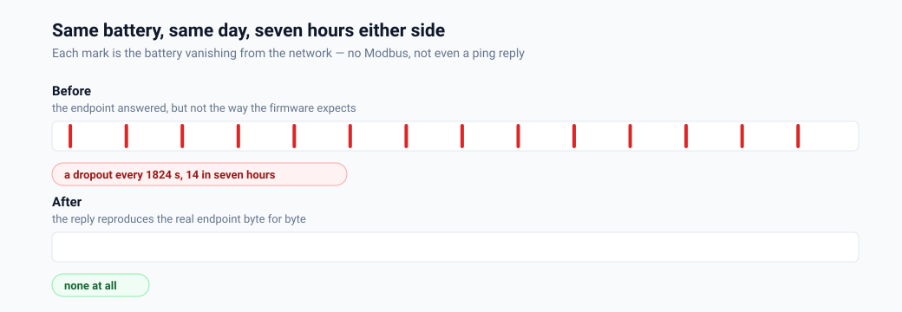
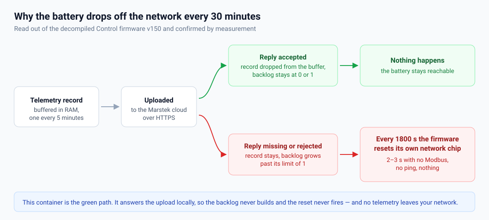
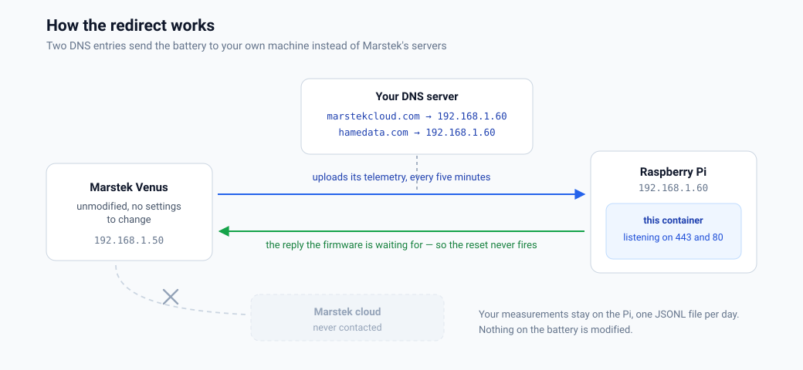

# Marstek Offline Endpoint

**Deutsch: [README.de.md](README.de.md) · Step-by-step guide: [docs/SETUP.md](docs/SETUP.md) ([deutsch](docs/SETUP.de.md))**

A small container for your home server that answers the telemetry upload a
**Marstek Venus** battery expects — Venus E, Venus D, Venus E v3. The battery
stops resetting its own network chip every half hour, Modbus TCP stays up, and
none of your measurements leave your network.



Measured on a Venus D running Control firmware v150, over LAN, on 26 August 2026.
Before, the battery vanished from the network every 30 minutes on the dot. After,
seven hours without a single one — and the upload settled into a metronomic
300-second rhythm, one per record, which is what an empty buffer looks like.

## Does this describe your problem?

- Your Marstek Venus **disappears from the network every 30 minutes** for a few
  seconds, then comes back
- Home Assistant shows the battery as *unavailable* on a regular rhythm, and a
  reload or a restart fixes it for a while
- Modbus TCP times out periodically — `Cannot connect to Modbus device at …:502`,
  `Timeout writing to register 0xA410`, `No response received after 0 retries`
- Even **ping** to the battery stops answering, for two to five seconds
- It started after updating to firmware **v150**, or it happens whenever the
  battery cannot reach the internet

If that is you: it is not your network, not your switch, and not your Modbus
integration. It is the battery's own firmware — and this stops it.

## The problem



On Control firmware **v150** the device buffers telemetry records and uploads
them to Marstek's cloud. If the upload does not drain that buffer, the firmware
**hardware-resets its own network chip** on a fixed timer:

| | Ethernet (CH395) | WiFi (FC41D) |
|---|---|---|
| timer | 1800 s (30 min) | 900 s (15 min) |
| backlog needed | more than 1 record | any record |

While the chip is in reset it is simply gone — Modbus TCP sessions die, ping
stops answering, and two or three seconds later everything is back. Forever, on
the dot. WiFi is the harsher variant, not the milder one, so switching the
battery to WiFi is not a way around it.

If you keep your battery away from the internet, that is what you get.

Full analysis with firmware addresses, conditions and the call chain:
<https://github.com/sphings79/marstek_venus_modbus_dev/issues/2>

## What this does



Two DNS entries point the battery at your machine. This container answers what
the firmware is waiting for, the backlog never builds, and the reset never fires.
Nothing on the battery is modified — there is no setting to change and no
firmware to flash.

As a side effect you get your own telemetry, locally: about seventy fields per
upload, in a JSONL file you own.

## Quick start

A prebuilt image is published for **amd64, 386, arm64, armv7 and armv6**, so a
normal server, an old 32-bit laptop, a NAS or any Raspberry Pi down to a Zero all
work. A 3B is plenty — this answers a handful of requests per hour.

```bash
docker run -d --name marstek-offline-endpoint --restart unless-stopped \
  -p 443:443 -p 80:80 \
  -e TZ=Europe/Berlin \
  -v "$PWD/data:/data" -v "$PWD/certs:/certs" \
  ghcr.io/sphings79/marstek-offline-endpoint:latest
```

`--restart unless-stopped` brings it back after a reboot, provided Docker itself
starts at boot (`sudo systemctl enable docker`). **Set `TZ`** — the real endpoint
answers in the device's local time, and without `TZ` the container's idea of
local time is UTC.

Or with compose — copy `docker-compose.yml` from this repo and `docker compose up -d`.

Ports 443 and 80 must be free on the host. A self-signed certificate is
generated into `./certs` on first start; delete it to get a new one.

**Never done this before?** [docs/SETUP.md](docs/SETUP.md) walks through the
whole thing from a blank SD card: flashing Raspberry Pi OS, a fixed address,
installing Docker, the DNS entries in Pi-hole and AdGuard Home, and how to prove
it worked.

## Point your DNS at it

The upload URL in firmware is `https://api-%s.marstekcloud.com/data-upload/v1/venus/%s`,
where `%s` is a region tag; the time endpoint lives on `eu.hamedata.com`.
Overriding the whole domains means the region never matters:

```
# dnsmasq / Pi-hole / AdGuard Home
address=/marstekcloud.com/192.168.x.y
address=/hamedata.com/192.168.x.y
```

If your battery ignores your DNS server, use a firewall rule instead: DNAT
anything from the battery's IP on ports 443 and 80 to the container. Either way
the battery must be able to *reach* the container — if it sits in an isolated
VLAN, allow that one route.

**Do not redirect the MQTT broker.** See [What it does not do](#what-it-does-not-do).

## Check that it worked

```bash
docker logs -f marstek-offline-endpoint
```

Within a few minutes you should see a time request and an upload:

```
2026-08-26 08:17:38 TIME   http GET eu.hamedata.com/app/neng/getDateInfoeu.php?uid=… (0 B)
2026-08-26 08:19:07 ACCEPT https POST api-eu.marstekcloud.com/data-upload/v1/venus/… (1204 B)
```

Two numbers tell you it is working:

- **Time requests: one per ~600 s.** Four in a burst, 20 s apart, means the reply
  is being rejected — see [How it was found](docs/HOW-WE-FOUND-IT.md).
- **Uploads: roughly one per 300 s, irregular.** A rigid 86-second rhythm means
  the backlog is above three and the firmware is throttling. That should resolve
  within an hour or two as the buffer drains.

Then watch the battery itself. This shell loop prints a line only when a ping is
lost, which is what a chip reset looks like from outside:

```bash
IP=192.168.1.50; F=0
while true; do
  if ping -c1 -W1 "$IP" >/dev/null 2>&1; then
    [ $F -gt 0 ] && echo "$(date '+%F %T')  UP after ${F}s"; F=0
  else
    [ $F -eq 0 ] && echo "$(date '+%F %T')  DOWN"; F=$((F+1))
  fi
  sleep 1
done
```

Two quiet half-hour windows and you are done.

## The clock

The device polls a time endpoint every ~600 s. This container answers it, so the
battery sets its real-time clock from your machine instead of from a cloud it
cannot reach. The reply is byte-for-byte what the real endpoint returns:

```
_2026_08_26_08_24_29_04_0_0_0
```

`HTTP_ParseServerDateTime_UpdateRTC` finds the underscore and reads fixed offsets
from it — year, month, day, hour, minute, second — ignoring the separators. The
four trailing fields stay constant while the time advances, so they are
parameters rather than time values; they are mirrored verbatim rather than
invented, because the firmware reads something from that region
(`HexChar_To_TimeOffsetIndex`) and guessing there would be reckless. Override
with `TIME_SUFFIX` if you ever learn what they mean.

**The real server answers in the device's local time**, and so does this one.
Measured by proxying a genuine reply through this container: its `Date` header
read `20:05:42 GMT` while the body read `_2026_08_25_22_05_42_…` — two hours
ahead, CEST. So set `TZ`. `TIME_LOCAL=0` forces UTC if you want it, and
`ANSWER_TIME=0` stops the container touching your device's clock at all.

Console lines carry local wall-clock time; the JSONL keeps ISO-8601 UTC, which
stays unambiguous for machines. Do not compare the two by eye without accounting
for the offset.

## Reading your telemetry

Everything the device uploads lands in `data/requests-YYYY-MM-DD.jsonl`:

```bash
./decode.py            # newest upload, decoded
./decode.py --raw      # including the keys nobody has identified yet
./decode.py --all      # every upload in the file
```

Only fields confirmed against a second source — the same device read over Modbus
at the same moment — are given a meaning; the rest is printed raw rather than
guessed at. Device ID, serial and IP are redacted unless you pass `--no-redact`.

## What it does not do

**MQTT is not served, and cannot be.** The device keeps an MQTT session with AWS
IoT, and that path verifies the broker's certificate against a CA stored in flash
*and* presents a client certificate of its own (`mbedTLS_SSL_Conf_Authmode(conf, 2)`).
Faking it would need the AWS signing key, which is the whole point of a
certificate.

The container can *log* connection attempts if you point the broker's hostname
here — that is how MQTT was ruled out as the cause of the dropouts. But leave it
alone in normal operation: an accepted-then-dropped connection makes the device
retry every 5.5 seconds, forever, on the same network chip everything else uses.
`MQTT_PORT=0` disables the listener.

**Other endpoints are logged, not answered.** Requests that are not the telemetry
upload or the time endpoint get a 404. Pretending to be an endpoint whose
expected reply nobody has reverse-engineered could change device behaviour in
untested ways. Watch the log first and decide deliberately. `ACCEPT_ALL=1`
answers everything with `{"code":0}` if you want to experiment.

## Keep it running — this matters more than it looks

A record is added to the buffer every five minutes and removed only when an
upload is answered. If more than one is left unconfirmed when the 1800-second
timer expires, the resets start — and once the condition is met it tends to stay
met, because the firmware then throttles uploads to one per 60 seconds.

So **downtime here is not free**. Use `--restart unless-stopped`, make sure
Docker starts at boot, and if the host reboots, check afterwards that the
container came back. If you do fall into the cycle, it clears itself once uploads
are being answered again — on the measured device it took about 45 minutes.

None of this is caused by running offline. The same thing happens whenever the
real cloud is unreachable for long enough; a LAN endpoint simply fails less often
than a WAN dependency.

## Settings

| Variable | Default | Meaning |
|---|---|---|
| `TZ` | `UTC` | **set this** — which local time the reply uses, e.g. `Europe/Berlin` |
| `ANSWER_TIME` | `1` | answer the time endpoint (sets the device's clock) |
| `TIME_LOCAL` | `1` | serve local time, as the real server does; `0` forces UTC |
| `TIME_SUFFIX` | `04_0_0_0` | trailing fields of the time reply, copied from the real endpoint |
| `ACCEPT_ALL` | `0` | answer every path with `{"code":0}` |
| `HTTPS_PORT` | `443` | |
| `HTTP_PORT` | `80` | plain-http hamedata endpoints |
| `MQTT_PORT` | `8883` | MQTT connection probe, log only; `0` disables |
| `LOG_DIR` | `/data` | one JSONL file per day |
| `CERT_DIR` | `/certs` | certificate and key |
| `MAX_BODY` | `262144` | bytes kept per request |
| `PROXY_TIME_IP` | — | diagnostic: forward the *time* request upstream and return its answer verbatim |
| `PROXY_TIME_HOST` | `eu.hamedata.com` | Host header used when proxying |
| `PROXY_TIME_PORT` | `80` | upstream port |
| `PROXY_TIME_MS` | `8000` | give up on the upstream and answer locally |

### Diagnostic: proxying the time request

Sometimes you need to know whether the device behaves differently when the reply
is *genuine* rather than a good imitation. No amount of matching bytes settles
that on its own — so `PROXY_TIME_IP` forwards the time request to the real
endpoint and returns what comes back, byte for byte, with no re-framing by Node.

**The telemetry upload is never proxied.** What leaves your network in this mode
is the time GET alone, which carries the device id and firmware versions — no
measurements. Unset the variable to go back to fully offline operation.

It takes an address rather than a hostname on purpose: this container is what the
device's DNS points at, so resolving the name here would loop straight back.

```bash
curl -s -H 'accept: application/dns-json' 'https://1.1.1.1/dns-query?name=eu.hamedata.com&type=A'
```

## How it was found

The mechanism came out of the decompiled firmware, but making the container
*acceptable to the device* took four wrong turns and one experiment that settled
it. If you are debugging something similar, or you want to know how far the
evidence actually goes: [docs/HOW-WE-FOUND-IT.md](docs/HOW-WE-FOUND-IT.md).

## Verified how?

The requirements were read out of the decompiled Control firmware v150 and then
confirmed against a real Venus D on firmware 150 over LAN:

- **The reply is byte-identical to the real endpoint's** — not merely similar. A
  genuine reply was captured by proxying one through this container, and the
  reply this container builds was diffed against it: same 232 bytes, same headers
  in the same order, same chunked framing. Only `Date`, `Trace-Id` and the
  timestamp differ, as they must. This matters more than it sounds: a reply
  assembled by Node instead — same body, same chunked encoding, but with
  `Keep-Alive: timeout=5` added and the headers reordered — was **rejected**, and
  the device retried four times and gave up without setting its clock.
- **The upload host's reply was captured raw too**, by POSTing an empty body and
  letting the gateway reject it with
  `{"code":51,"message":"The d field is required"}`. It sits behind Kong and adds
  seven headers the time endpoint does not send; this container reproduces them,
  in the same order.
- **The real endpoint answers keep-alive and never closes**, so the device waits
  out its full 20 s receive timeout on every upload. That is normal, not a fault.
  What does break things is cutting the connection while it is still waiting:
  `mbedTLS_SSL_Recv_WithRetry` (`0x08015914`) returns the error instead of the
  bytes, and the caller stores that as a length. This container holds the
  connection for 25 s and then ends it cleanly; it never destroys it.
- **The firmware's own check** (`FUN_0801774c`: `strstr` for `"code":`, then
  `atoi` on the next byte) evaluates our body to 0 — accepted.
- **TLS 1.0, 1.1 and 1.2 handshakes all succeed**; the device presents no client
  certificate on this path and validates nothing, matching `Authmode 0` in
  `HTTPS_TLS_Session_Init`.
- **The region actually used by the device (`eu`)** was observed on the wire
  rather than assumed.

## A warning worth reading

TLS here is deliberately permissive: versions 1.0–1.2 and `SECLEVEL=0`, because
the device pins an older range in firmware and the exact values were not
resolvable. That is fine for one embedded client on your LAN talking to a server
that holds nothing of value. **Do not expose this container to the internet.**

## Related projects

- 🔌 **[Marstek Venus Modbus — dev fork](https://github.com/sphings79/marstek_venus_modbus_dev)** —
  the Home Assistant integration that reads the battery over Modbus TCP. It cannot
  prevent these dropouts, but it recovers from them in seconds instead of minutes,
  and it raises a repair when the device drops out of RS485 control mode on its own.
  Most people running this container want that too.
  ([upstream](https://github.com/ViperRNMC/marstek_venus_modbus))
- 🖥️ **[venuscontrol](https://github.com/sphings79/venuscontrol)** — cloud-free Web Bluetooth
  control panel for Venus A / D, including OTA firmware updates
- 🔬 **[Venus D firmware reverse engineering](https://github.com/sphings79/Marstek-Venus-D-Firmware-Reverse-Engineering)** —
  where the analysis behind this container comes from
- 📦 **[Marstek firmware archive](https://github.com/sphings79/marstek-firmware-archiv)**
- 🌐 **[More projects and tools](https://sphings-dev.de/)**

## Licence

MIT — see [LICENSE](LICENSE).

---

## ☕ Support

These tools are built and maintained in my free time, and they stay free, open and cloud-free.
If one of them saved you an afternoon, you can [buy me a coffee](https://buymeacoffee.com/sphings).

[](https://buymeacoffee.com/sphings)
